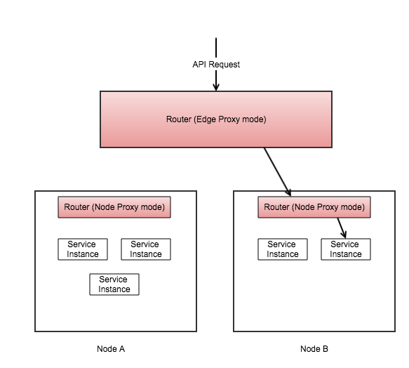

# Router
The Router service is a reverse proxy running on top of zuul that can be run in two modes.  The default mode is a proxy service that runs on each individual node where the framework is running, and provides a single exposed port for all incoming requests to services running on a node.  The second mode is the edge proxy mode - all API requests coming from outside of the framework are funneled into the edge proxy, which in turn will forward to the appropriate node router proxy.



## Configuration
`router.edgeProxyMode` - boolean property to set the mode.  Setting this to true designates the router instance as an edge proxy.  This property is not dynamic and needs to be present at bootstrap.  To pass this property in as a command-line argument: `--router.edgeProxyMode=true` 

### Routes
`router.routes.*` There is an option of adding routes through configuration, as well as dynamically via the event bus.  Route configuration is also dynamic and in RefreshScope, but will never overwrite dynamic routes that have been created by other management processes.  Through configuration, routes can only be added, not deleted.  The following properties make up a route:

```
router:
  routes:
    hello-world:
      vHost: hello.cooksys.com:8764
      defaultVersion: "1.0.1" 
      proxy-routes:
        "/hello-world/1/0/1": "1.0.1"
        "/hello-world/1/0/2": "1.0.2"
```

Routes contain all the information necessary to route to a service from an Edge router and from a Node proxy router.  The vHost param specifies the host header in the initial request, and is used by the Edge proxy to determine the serviceId.  It will then run a series of filters that determine the version, and append the path (located in `proxyRoutes` map) to the request before forwarding to the Node proxy.

The client can optionally specify which version it is requesting by appending a versioning scheme to the url pattern.  This pattern must match the forllowing template: `/_/{major}/{}/{}/_/{path_remainder}`

Example: `http://hello-world.cooksys.com/_/1/0/1/_/hello` - tells the pre-decoration filter that the client is requesting version 1.0.1

If version is not supplied by the client using this pattern, then the pre-decoration will set the minimum version to `defaultVersion` (configured in the route)

### Ribbon Semantic Version Enforcement
We have added custom rules to the Ribbon load balancer for enforcing semantic version compatability.  There are 3 levels of granularity that the load balancer will use to filter compatable servers from the discovery request. 
`SemanticAccuracy.MAJOR`
`SemanticAccuracy.MINOR`
`SemanticAccuracy.PATCH`

The default is `MAJOR`, where a request's version will be routed to any compatable semantic version.
The filter chain has the ability to set this accuracy in the Zuul request context using the key `"route.versionAccuracy"`.  The rules for the accuracy level are as follows: 

#### `SemanticAccuracy.MAJOR`
* Only route to same Major version
* Request minor version must be less than or equal to registered instance version
* If these two rules pass, route to any patch version

**Example:** Filter chain specifies version `1.2.1` with MAJOR accuracy

| Service Instance Version | Should Route? |
| ------------------------ | ------------- |
| `1.2.1`                  | yes           |
| `1.2.3`                  | yes           |
| `1.3.0`                  | yes           |
| `1.1.9`                  | no            |
| `2.1.0`                  | no            |

#### `SemanticAccuracy.MINOR`
* Only route to same Major/Minor version
* Route to any patch version

**Example:** Filter chain specifies version `1.2.1` with MINOR accuracy

| Service Instance Version | Should Route? |
| ------------------------ | ------------- |
| `1.2.1`                  | yes           |
| `1.2.3`                  | yes           |
| `1.3.0`                  | no            |
| `1.1.9`                  | no            |
| `2.1.0`                  | no            |

#### `SemanticAccuracy.PATCH`
* Only route to exact Major/Minor/Patch version

**Example:** Filter chain specifies version `1.2.1` with PATCH accuracy

| Service Instance Version | Should Route? |
| ------------------------ | ------------- |
| `1.2.1`                  | yes           |
| `1.2.3`                  | no            |
| `1.3.0`                  | no            |
| `1.1.9`                  | no            |
| `2.1.0`                  | no            |

### Eureka Metadata
Router determines where requests are forwarded by checking the discovery cache for metadata containing version and host information.  Every service that registers must supply the semantic version as metadata when registering with Discovery.  This can be done by passing a command line argument (spring property) to the service: `--eureka.instance.metadataMap.version=1.2.3`

When a service (running in a Docker container) registers with discovery, Spring Cloud's Eureka instance will by default register with the Docker container's hostname.  Since the containers do not all know about each other's hostname, when starting services you will need to pass in this commandline argument: `--eureka.instance.preferIpAddress=true`.  This tells the eureka instance to provide the container's IP address as the hostname during registration.  This hostname is used for routing within the same node (i.e. node proxy -> service instance).  

In order for the Edge proxy to find the correct node host to route to, an additional metadata item is required: `--eureka.instance.metadataMap.proxyHost=node1.cooksys.com`

## `/routes` endpoint
Router has an actuator endpoint `/routes` for managing routes. It should be noted that actuator admin endpoints need to be configured on a separate port than the proxy port using the `management.port` propery.  Since the /routes endpoint is configured as an actuator endpoint, it will be located on the management port.

[Routes API Documentation](./routesApiReference.md)


## Zuul Filter Chain
The following filters are provided by default and control the various aspects of routing to backend services.

### Pre Filters
#### `EdgeProxyPreDecorationFilter`
Only enabled when the `router.edgeProxyMode` property is set to `true`. This filter is the first filter in the chain to execute, and determines the serviceId and minimum version to route to using the `host` header in the request and optionally the semantic version prepended in the path.  Checks configured routes for a match then sets the following properties in Zuul's `RequestContext` that are used by the routing filter to forward the request:

| Key                    | Value                           | Value Type                             |
| ---------------------- | ------------------------------- | -------------------------------------- | 
`route.version`          | Minimum version to route to     | `com.github.zafarkhaja.semver.Version` |
`route.requestVersion`   | Version requested by the client | `com.github.zafarkhaja.semver.Version` |
`route.path`             | Original request path           | `String`                               |
`route.version.accuracy` | `SemanticAccuracy.MAJOR`        | `SemanticAccuracy` enum                |
`route.proxyRoutes`      | Proxy routes defined in Route   | `Map<String,String>`                   |
`route.serviceId`        | ServiceID of the matching Route | `String`                               |

#### `NodeProxyPreDecorationFilter`
Only enabled when the `router.edgeProxyMode` property is set to `false`.  This filter gets the version to route to from the URL pattern that is prepended by the Edge-proxy (i.e. `/1/2/3/someservice`).  It will match the route based off of this version prefix, then strip the prefix before setting `route.path` in the context. Sets the following values in Zuul's RequestContext:

> Sets `route.version.accuracy` to `PATCH`, since exact version was already determined by the EdgeProxy's filter chain

| Key                    | Value                           | Value Type                             |
| ---------------------- | ------------------------------- | -------------------------------------- | 
`route.version`          | Actual version to route to      | `com.github.zafarkhaja.semver.Version` |
`route.path`             | Path stripped of version prefix | `String`                               |
`route.version.accuracy` | `SemanticAccuracy.PATCH`        | `SemanticAccuracy` enum                |
`route.serviceId`        | ServiceID of the matching Route | `String`                               |

### Routing Filters
#### `LoadBalancedRoutingFilter`
Primary routing filter that is responsible for physically forwarding the request.  In Edge-Proxy mode, it will forward to the `proxyHost` metadata value (see above).  In Node-proxy mode, it will forward to the `eureka.instance.host` found in discovery cache.

This filter uses Ribbon to choose the next server in the load balancing algorithm.  The custom rule for filtering servers based on compatable semantic version lives here as well.  

Once a server is chosen, the request is built, and forwarded using Apache's ClosableHttpClient and the action is wrapped in a Hystrix circuit breaker. The circuit breaker is labeled with unique serviceId/version combo for viewing in the Hystrix dashboard.

### Post Filters

#### `SendErrorFilter` (provided by Spring Cloud)
Sends an error response if found in the context. In spring-cloud-core version 1.2.6 the filter looks for `error.statusCode` and `error.exception` in the RequestContest, but in future releases (1.3.x), the criteria for `shouldFilter()` checks for the exception using `context.getThrowable()` and expects `ZuulException`, which contains the status code.  In order to support both versions, when an exception is caught in a filter, we put the exception in the context in 2 places: 1) wrap the throwable in a `ZuulException` and put it in the `context.setThrowable()`, as well as placing the throwable in `error.exception`, and setting the `error.status_code` property in the context.

#### `SendResponseFilter` (provided by Spring Cloud)
Executed if there are no errors when forwarding the request.  Flushes the stream and sends the response.

## Tutorial
In normal circumstances, the edge proxy and node proxy will be bootstrapped by the framework, but if you want to manually run this  service, you can find a tutorial [here](./tutorial.md)

## Configuration Properties
For a complete list of properties, see [RouterProperties](./src/main/java/com/cooksys/cloud/router/configuration/RouterProperties.java)


