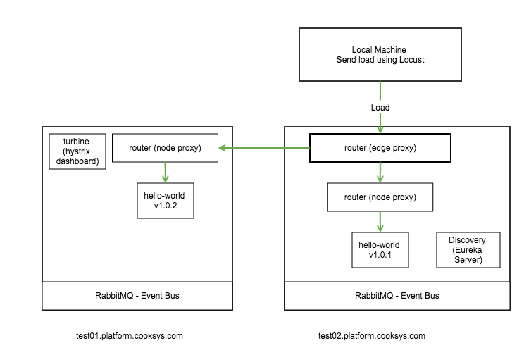
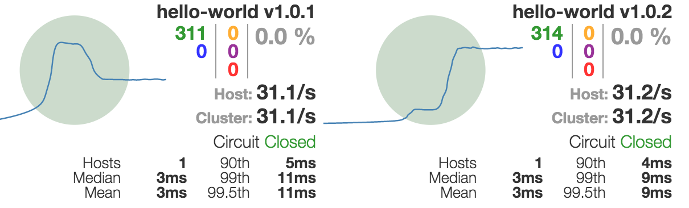
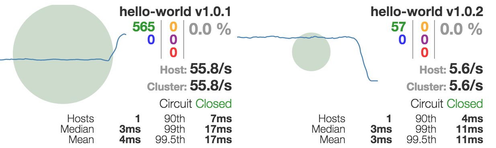

# Traffic Ratio Demo
This demo demonstrates the ability to create Canary and Blue-green deployments using the Traffic Ratio API in router. The demo will be across two nodes, and will have two hello-world instances running with different versions.  



## Prerequsites
* Discovery and Configuration services are configured and started.  For more info on how to do this, check out the [Configuration Tutorial](../configuration/configuration_tutorial.md)
* Two EC2 instances with Docker installed and the framework Docker images built and installed in the local registries.
* Router is running in node-proxy mode on both hosts and also a edge-proxy on one of the hosts, and two versions of hello-world - one on each host. Follow the tutorial here for how to do this: [Manually Running Router in Edge Proxy and Node Proxy modes](tutorial.md)
* Install Locust on your local machine - [Locust installation instructions](http://docs.locust.io/en/latest/installation.html)


> This document will refer to the two EC2 instances hostnames as `test01` and `test02` - change these hostnames to match your own test instances.  Also DISCOVERY_HOST environment variable should be set (see the previous tutorials)

## Setup
You will first need to start turbine so you can monitor the circuit breakers in the router-edge routing filter. 

Commit the following file into your configuration repository:

**turbine.yml**

```
turbine:
  cluster-name-expression: new String("default")
  appConfig: router-edge
```

Start the turbine container on `test02`:

```
docker run -d --name turbine -p 8762:8762 turbine \
    --eureka.client.serviceUrl.defaultZone=http://$DISCOVERY_HOST:8761/eureka/
```

Point your browser to `http://test02/hystrix`

Put the following URL in the input box:
`http://localhost:8762/turbine.stream`

Click "Monitor Stream"

Send a few requests to hello-world through the router (see [Manually Running Router in Edge Proxy and Node Proxy modes](tutorial.md)).

You should see two circuit breakers on the console.

## Load test setup
On your local machine, create a file called `locustfile.py`:

```
from locust import HttpLocust, TaskSet, task

class UserBehavior(TaskSet):
    @task(1)
    def hello(self):
        headerDict = {'Host': 'hello-world.cooksys.com:8764'}
        self.client.get("/hello",headers=headerDict)


class WebsiteUser(HttpLocust):
    task_set = UserBehavior

    min_wait = 1000
    max_wait = 2000
```

From within the same directory as this file, type: 

```
locust --host=http://test01:8764
```

point your browser to http://localhost:8089

In the inputs, put 100 users, and 100 hatch rate, then click "Start swarming"

Go back to the hystrix page, and you will see that router is load balancing to both versions of hello-world.



We can configure the ratio of requests between versions by provisining a Ratio rule using the api.  Send a `POST` request to `http://test01:8081/routes/hello-world/ratios` with the following payload:

```
[
  {
    "version": "1.0.1",
    "trafficRatio": 10,
    "accuracy": "PATCH"
    
  },
  {
    "version": "1.0.2",
    "trafficRatio": 1,
    "accuracy": "PATCH" 
  }
]
```

You will see the circle get much smaller on the hello-world v1.0.2 circuit breaker because we are now routing 1 out of 10 reqests to this version.  You can adjust the ratios by sending the same request, but modifying the "trafficRatio" field.

