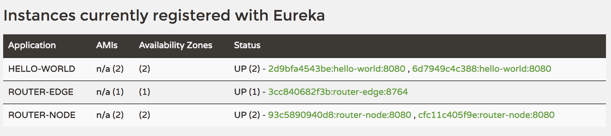

# Tutorial: Manually Running Router in Edge Proxy and Node Proxy modes

## Prerequisites
* You will need 2 virtual hosts with docker installed
* Discovery and Configuration services are configured and started.  For more info on how to do this, check out the [Configuration Tutorial](../configuration/configuration_tutorial.md)

> We will refer to the hostnames `host1` and `host2`.  Replace these hostnames with the actual dns name of your hosts.  We will also assume that rabbit is running on `host1`

## Build the Docker images
Build the cook-cloud-framework on each host using `gradle buildDocker` - this will install the docker images necessary for this tutorial.  We will be using the following images: discovery, router, and hello-world

## Setup Steps

Commit the following configuration files to the git repository you created in the [Configuration Tutorial](../configuration/configuration_tutorial.md)


**router-edge.yml**

```
router:
  edgeProxyMode: true

server:
  port: 8764
  
management:
  port: 8081
```

**router-node.yml**

```
router:
  edgeProxyMode: false
  
server:
  port: 8080
  
management:
  port: 8082
```

**hello-world.yml**

```
server:
  port: 8080
  
eureka:
  instance:
    preferIpAddress: true
```
> This document will refer to the two EC2 instances hostnames as `test01` and `test02` - change these hostnames to match your own test instances

Run the following commands on `test01`

```
export DISCOVERY_HOST=`hostname`

# Start the Edge proxy:
docker run --name edgeproxy -d -p8764:8764 -p8081:8081 router \
    --spring.application.name=router-edge \
    --eureka.instance.hostName=`hostname` \
    --eureka.client.serviceUrl.defaultZone=http://$DISCOVERY_HOST:8761/eureka/

# Start the Node proxy:
docker run --name nodeproxy -d -p8080:8080 -p8082:8082 router \
    --spring.application.name=router-node \
    --eureka.instance.hostName=`hostname` \
    --eureka.client.serviceUrl.defaultZone=http://$DISCOVERY_HOST:8761/eureka/

# Start hello-world
docker run --name hello-world -d hello-world \
    --eureka.client.serviceUrl.defaultZone=http://$DISCOVERY_HOST:8761/eureka/ \
    --eureka.instance.metadataMap.version=1.0.1 \
    --eureka.instance.metadataMap.proxyHost=`hostname`
    
```

Run the `hostname` command on `test01` to get the discovery hostname in the next step

Run the following commands on `test02`:

```
export DISCOVERY_HOST=  ### test01 hostname from previous step goes here

# Start the Node proxy:
docker run --name nodeproxy -d -p8080:8080 -p8082:8082 router \
    --spring.application.name=router-node \
    --eureka.instance.hostName=`hostname` \
    --eureka.client.serviceUrl.defaultZone=http://$DISCOVERY_HOST:8761/eureka/

# Start hello-world:
docker run --name hello-world -d hello-world \
    --eureka.client.serviceUrl.defaultZone=http://$DISCOVERY_HOST:8761/eureka/ \
    --eureka.instance.metadataMap.version=1.0.2 \
    --eureka.instance.metadataMap.proxyHost=`hostname`
```

Point your browser to `http://host1:8761`.  It should look something like this:



## Create a route for hello-world
From curl or postman, send a `POST http://host1:8081/routes` with the following json payload:

```
{
  "serviceId": "hello-world",
  "vHost": "hello-world.cooksys.com:8764",
  "defaultVersion": "1.0.1",
  "proxyRoutes": {
    "/hello-world/1/0/1": "1.0.1",
    "/hello-world/1/0/2": "1.0.2"
  }
}
```

Verify that the route was created and published to both Node proxies: 

`GET http://host1:8081/routes`

`GET http://host1:8082/routes`

`GET http://host2:8082/routes`

Should all return something like this (links will be the only think that is different):

```
[
  {
    "link": "http://test02.platform.cooksys.com:8082/routes/hello-world",
    "serviceId": "hello-world",
    "vHost": "hello-world.cooksys.com:8764",
    "defaultVersion": "1.0.1",
    "proxyRoutes": {
      "/hello-world/1/0/2": "1.0.2",
      "/hello-world/1/0/1": "1.0.1"
    }
  }
]
```

## Send requests to hello-world
For the Edge proxy to route correctly, it depends on the host header to have the value `hello-world.cooksys.com`.  

Now send a `GET http://host01:8764/hello` - (set the Host header: `Host:hello-world.cooksys.com:8764`)

The response contains the version of hello-world handled the request:
```
{
  "greeting": "Hello",
  "name": "World",
  "version": "1.0.1"
}
```

Repetedly send the same request and you will see that version number change as the edge proxy load balances between the versions.

if you explicitly specify a version, the edge proxy will only route to that version: `GET http://hello-world.cooksys.com/_/1/0/2/_/hello`


